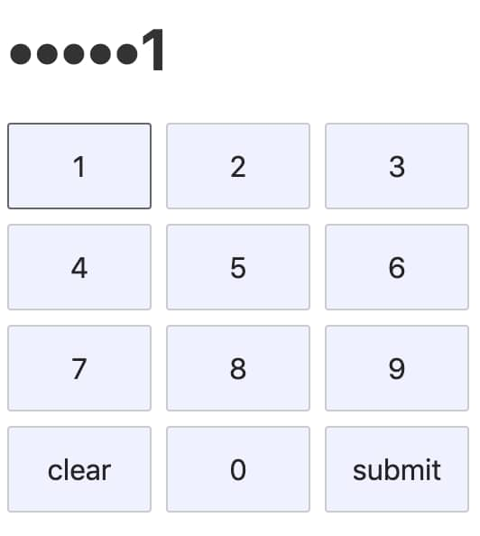

In this post, I’ll try to explain by simple examples what the thing is JS RegExp lookarounds.

Let’s pretend you need to make a pin-code style text input. Something like this one:

Noticed that all digits are dots except the last one? That’s really easy to implement with just one line of code using RegExp lookaround (negative lookahead in this case):

    pin.replace(/\d(?!$)/g, ‘•’)

Well, what just happened here? We’ll figure it out, but firstly let’s review a simpler example.

We have a Markdown string:

    - 1 potato for 2€
    - 2 tomatoes for 3€
    - 5 bananas for 4€

Let’s write a code that finds all digits before the euro sign. With lookarounds it can be done like this:

    str.match(/\d+(?=€)/g)

Here’s what it means:

* **\d+** One or more digits

* **(?=€)** Followed by €

That’s it! No brainer at all.

That (**?=**your_regexp) is called a **positive lookahead**. You can interpret this like because it looks ahead with a positive attitude for what goes next.

In the result you will get an array:

    [“2”, “3”, “4”]

Notice that it returned what was before the lookahead, **\d+** in our case. The € sign itself is not included in the resulting array.

Now I want to find all digits that are not followed by € sign. That’s also very easy.

    str.match(/\d+(?!€)/g)

It’s a **negative lookahead**. The main difference is **!** sign instead of **=**.

So, this one will return quantities:

    [“1”, “2”, “5”]

That’s precisely the digits I wanted.

Now we can go back to our pin code example:

    pin.replace(/\d(?!$)/g, ‘•’)

* **\d** Just a digit

* **(?!$)** Not followed by an end of the line (**$** in regexps is a special char meaning an end of the line)

Summing it up, find all digits that are not at the end of the line and replace them with ‘•’. Easy!

Well, if there is a lookahead, there should be a lookbehind probably. And yes, there is one.

Unlike €, $ is usually written before a digit.

    - 1 potato for $2
    - 2 tomatoes for $3
    - 5 bananas for $4

To find values now, we need a bit different code:

    str.match(/(?<=\$)\d+/g)

This is called a **positive lookbehind**. Then escaped **$** sign (because we do not want to consider it as an end of the line, we escape it with a backslash).

It finds all digits that are preceded by **$** sign.

On the other hand, there is a (**?<!**your_regexp) **negative lookbehind**.

    str.match(/(?<!\$)\d+/g

Which finds all digits that are not preceded by $ sign.

To conclude, if you need to find something followed or not followed by something, use these ones:

* **Positive lookahead:** (?=your_regexp)

* **Negative lookahead:** (?!your_regexp)

If you need to find something preceded or not preceded by something, use these ones:

* **Positive lookbehind:** (?<=your_regexp)

* **Negative lookbehind:** (?<!your_regexp)

To check all the examples yourself you can use [regex101](https://regex101.com/). It’s a great place to test all your regexps.

*P.S. Be careful about using lookbehinds in JS as it has partial support on the moment of writing this post. Check [caniuse](https://caniuse.com/#search=lookbehind) to be sure.*
